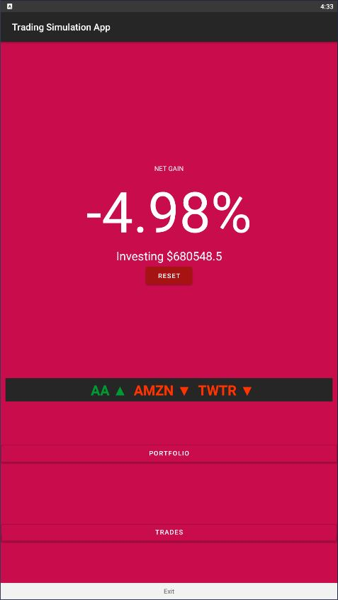
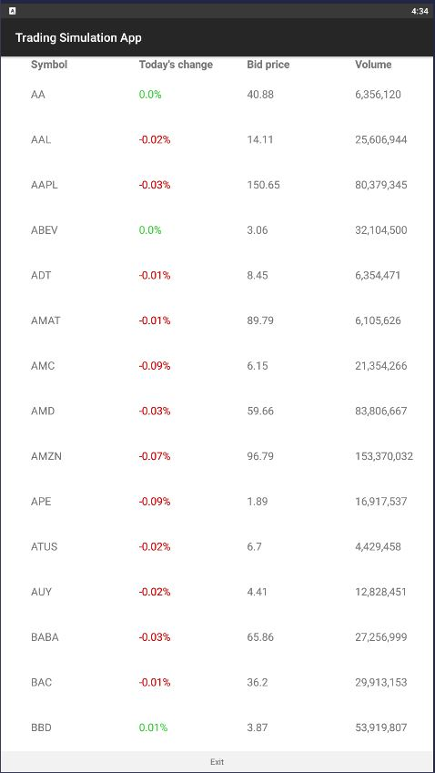
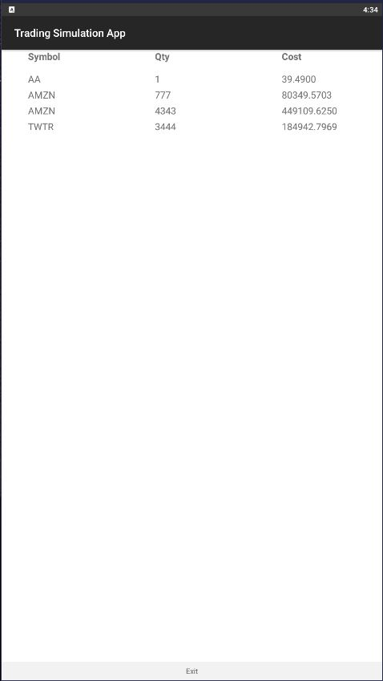

# Trading Simulation App report

## Repository

**[Click here to go to repository](https://github.com/duncan-ship-it/trading-simulation-app)**

## Summary

An Android app that allows users to test various market strategies using real-time international stock data from the IEX exchange.

## Libraries/Resources used

### Stock API

[Tiingo REST API for IEX](https://api.tiingo.com/documentation/iex)

Some of the alternatives I explored beforehand:
  - Finnhub
  - Tiingo websocket
  - Yahoo Finance wrapper for Java

### HTTP library
[OkHttp3](https://square.github.io/okhttp/) - Required to make HTTP requests to API

### Database

[Firebase SDK](https://firebase.google.com/)

### Chart layout component

[MPAndroidChart](https://github.com/PhilJay/MPAndroidChart)

### Prototyping tool

Adobe XD

## App Design

### Initial prototype

[**Click here to go to interactive prototype**](https://xd.adobe.com/view/cce651a8-982f-415b-8d1d-8265a1076c6d-99b5/)


### MainActivity

This serves as a main menu for the app, whilst providing helpful metrics which help the user identify their performance. From here, the user can navigate to either their portfolio or the stocks activity, which lists available stocks which they can order.

The grey bar will display the stocks the user is currently invested in, with an arrow indicating an increase or decrease in the daily price. When the user presses the reset button, all orders are cleared, as well as the amount invested, resetting this figure to 0.

The background color of this activity is dependant on the net gain figure. It will transition from green to red, with green corresponding to good performance, and red the opposite.



### StocksActivity

This activity provides the user with a list of stocks, their current intraday change, as well as their bid (aquisition) price and volume. When a row is tapped on, a detail activity is shown, which allows the user to buy and sell the corresponding stock at their respective market values, as well as see the recent trend of the stock price.



### PortfolioActivity

This activity summarises the user's current holdings in stock, showing the symbol names, quantity, and overall cost of this aquistion (product of quantity and unit price).



### DetailActivity

This activity appears when the user taps on a stocks row in either the StocksActivity or the Portfolio activity, which provides extra detail on each stock, whilst allowing the user to modify (or delete, if all units sold) or create new orders (sell and buy respectively).


### UI patterns utilised

**Continuous Scrolling**

The overflow of the stock/portfolio list allows the user to intuitively scroll down through the various stocks the user can buy. Nearly all social media apps feature continuous scrolling as a means to find new content with minimal effort, as a means to maintain engagement with the app.

**Notifications**

When the user attempts to buy or sell stocks, a toast is made, notifying the user of success (or invalid input):


This is a common way to quickly notify users of events that have occurred, seen across many types of app types, most notably ones with login functionality (incorrect password notification).

**Pricing table**

The stocks activity quickly summarises the prices of all the stocks, mimicking many other apps which utilise this pattern to quickly show the user their price ranges for their products/services. This UI pattern is seen in various types of apps (free to play games do this to encourage the user to spend money in the app, although is often disguised as the premium in-game currency as opposed to price figures).


## Feedback received

1. _For added functionality I would suggest a saved portfolio page where users can see and interact with all their stocks they saved and bought or sold with._

    _For UX, it would be better for the buy and sell buttons and TextInputs to be smaller and centered because here the cost of making a mistake is high since people are supposed to trade with their real money. So, if the buttons are bigger, theres more room to make mistakes._

2. _Great application idea. Stock Simulator is always interesting as different stock simulator applications compete to provide functionalities that are as accurate to a real stock exchange application as much as possible. Many of the stock simulators application out there also provide additional features to attract more users. I like your idea of utilizing the entire screen to display the list of stocks, as it provides clarity to the data. The red and green coloring of the stock's rates is also very well implemented as it highlights the importance of each stock. There are a few considerations/suggestions I have in mind:_

    * _I think with the large screen size, the text on each row can be larger. Enhancing visibility and readability would reduce the chances of user reading wrong information._

    * _I think that the sell and buy buttons should do a page transition instead of showing a toast/snackbar notification. Toast and snackbar notifications are usually meant for not-so-important to fairly important information. As for this case, buying and selling have a large impact on the user. If the user did not notice, they could also click the buttons several times; which could cause more serious issues._

    * _I understand this is probably out-of-scope for this assignment, but many stock applications also provide the ability to see real-time data and changes of the data. A graph usually highlight these changes very well. Incorporation of a graph would make it even more helpful to the user._

    _However, I think overall, your application idea and execution were done to a great quality. I also particularly enjoyed the demo. Great stuff!_

3. _The app is very well designed I like the layout of the data and the color scheme. However the only thing I have issue with is perhaps the buttons should be a little more stylized and smaller rather than taking up the whole screen._

    _A great application Idea with great execution!_

4. _Good thinking on the app. I liked the features you provide. It is great how you have provided the important information on the stocks listed page using recycler view and colour-coded them according to the price. However, I feel the UI is very dull. You can use brighter colours and make the text more readable. The button shouldn't be occupying the entire screen, try using "wrap content" instead of "match parent", and try to add more features to the buying and selling page like stop-loss etc. You can also think about including a details page about the stock where you show the charts and other ratios._
   
5. _Hi, just here to say this is really neat. And unique, amongst our other projects here. Sure, there might be plenty apps that let you paper trade, but I can be sure this one won't try to sell me crypto or financial coaching or whatever. Other than the usual request for a dark mode, I have noting else to say. Keep up the good work._

6. _This is quite a unique idea for a custom project with room for a lot more functionality. My suggestion would be to implement a watch list to independently monitor selected stocks. It's a common but integral feature in trading apps._

## Feedback analysis and improvements

### Overview

The main points of criticism related to the UI of the app. Notably, the reponses mentioned that the buttons are too large, the input fields should have centered text alignment, and the text size is too small.

The non-UI criticisms were either out of scope, or features already planned for the current app. For instance, response 1's suggestion of a portfolio activity was already planned, whereas response 4's suggestion of implementing stop-loss was not included in the primary scope (although I had plans to implement more advanced ordering features if work was completed ahead of schedule).

### Buttons too large

The feedback received was largely related to the UI of the app. 2 of the 6 responses mentioned the sizing of the buttons being too large, which may result in them being pressed by accident. This would be especially critical when it comes to buying/selling stock.

To remedy this issue, I added significant horizontal margins to the buy and sell buttons, minimising the chances of the user accidentally tapping either button. For the less critical buttons, I decided that tapping these buttons by accident was not such a big deal, since they are purely for navigational purposes.

### Centering input field text alignment

Following response 1's advice, I centered the input fields within the DetailActivity. This not only improves the aesthetics of this activity, it is also much more readable, since the user's input appears closer to the center of the screen.

### Text too small

I increased the text size of each row font in the Stocks and Portfolio activities, making this data more readable, following response 2's advice.

### Non-UI remedies

Response 1 mentioned the addition of an activity that showcases the user's portfolio. Since finishing the app, this is now a feature (it was also intended to be one, just the WIP version did not feature this activity). Similarly, response 4's suggestion of a chart in the detail activity was a feature of the final app (just wasn't available in the WIP version).

## Application architecture

### UML Overview


### Application flow

Within the MainActivity, both user-made orders and stock data is loaded in asynchronously. This is done here since we need this data to calculate the profit margin of the user, involving the acquisition cost and current value of each of the user's stocks. All stock-related data is reloaded in the `onCreate` and `onResume` lifecycle methods. 

As seen from the associations, the Stocks activity and Portfolio activity become available from the Main activtiy, and are launched as intents. The portfolio activity will independently retrieve the orders using a Firestore reference object (refer to Appendix). Similarly, the stocks activity independently retrieves the stock data from the API.

The reason why data is retrieved seperately from the main activity in both of these activities is in case the user enters this activity before this data is loaded in the main activity, meaning that these activities will be sent no data.

Within the Stocks activity, displaying the list of available stocks, the user can navigate to the Detail activity, which shows a more in-depth view of the stock, including it's historical prices, and it's current buy/sell price.

### Data storage

For storing data, I decided to use serialisable data classes that hold the values from the API/database response. In doing so, we can simply convert the a given JSON string into an instance of this data class using `Json.decodeFromString<T>(string)`, where T is the data class. This is a lot more elegant, scalable and robust than attempting to extract the values from the raw string, and leaves us with clean objects with attributes as values (e.g., `listOfStocks[0].price`). For further information, refer to Appendix A.

### Use of Fragments

I decided to make the exit widget bar a fragment, being a reusable UI component which appears in every activity. This fragment is included declaritively in each activity's layout file (hence it is not associated with any other class in the UML). This also means future changes to this component will be reflected in all instances of the frament, being more robust than simply declaring the child views in each activity layout file.

### Use of RecyclerViews

RecyclerViews where utilised as list layout views for both the portfolio and stock scrolling activities. The reason for this is that they are more optimized than ListView for longer lists (especially needed for the stocks activity, being a long list of stocks), reusing existing placeholder view rows. It is also more customisable than ListView, [being considered the preferred view according to the Android docs.](https://developer.android.com/reference/android/widget/ListView)

### Use of ViewModels/LiveData

LiveData was used to store the database orders, so this data could be observed (Appendix A). Meanwhile, a ViewModel was used to retrieve API data, which was stored as a LiveData attribute within the ViewModel.

The reason why is that the API logic was much more complex than the database retrieval, such that it was cleaner and more cohesive to abstract this logic into it's own ViewModel class. 

Another reason was the relatively slower latency of the API compared to the Firestore latency. This meant that the ViewModel would cache the API response on reset, and another database response could simply be retrieved, at negligible cost in terms of time.

### Navigability

On each activity, there is a widget bar fragment, which allows the user to exit each activity (and ultimately the app from the Main Activity), without relying on hard or soft buttons. This may be helpful to a less tech-savvy user, who is used to using in-app controls to navigate, as opposed to the Android buttons.

## App limitations

### Live updates

The app currently does not update on an interval (e.g., every 5 seconds), however will refresh on activity restart or resume. For instance, if the portfolio or stocks activity are browsed, and then exited, the resuming main activity will update the data.

A solution to this drawback would be to run a thread that would call the update methods on a set interval, (e.g., 5 seconds) which would allow the data to be updated without relying on lifecycle event handling methods such as `onCreate` and `onResume`.

### Amount of stocks

Currently the app allows the user to trade only 100 of the most traded symbols on the IEX (out of the thousands that are listed on the exchange), limiting the user's ability to test out strategies on less traded symbols.

A workaround to this would be to procedurally retrieve new stocks from the API as the user scrolls through the stock activity (basically infinite scroll).

### Choosing which stock order to sell

Currently the app will try to sell off the inputted number of units by iterating through orders consisting of the same stock symbol, in FIFO (First In, First Out) order. If these orders were made at differing price points, this may not be desireable functionality for the user.

A solution to this would be to facilitate the option to choose which orders to partially or fully sell off, through the addition of a list of all orders made of a particular stock inside the detail activity. This offloads the responsibility to the user to decide when to sell certain orders.

## Appendix A - Code snippets

### Retrieving data from Firestore

```kotlin
val db = Firebase.Firestore()

db.collection("orders")
    .get()
    .addOnSuccessListener { result ->  // callback lambda called when data is received
        for (document in result) {
            println("${document.symbol}: ${document.price}")
        }
    }
```

### Deserialising JSON data

```kotlin
// take json response body and parse as list of HistoricalStockData instances
val historicalData = Json.decodeFromString<List<HistoricalStockData>>(body)
```

### Retrieving data from REST API

```kotlin
val url = "https://api.tiingo.com/iex/$symbol/prices?startDate=$currentDate&resampleFreq=" +
                "4hour&token=$token"

val request = Request.Builder()
    .url(url)
    .build()

val call = client.newCall(request)

// enqueuing call allows multiple calls to be made and processed at the same time
call.enqueue(object: Callback {
    @Throws(IOException::class)
    override fun onResponse(call: Call?, response: Response?) {
        val responseBody = response?.body()?.string()

        responseBody?.let { body ->
            val historicalData = Json.decodeFromString<List<HistoricalStockData>>(body)
            onSuccess(historicalData)
        }
    }

    override fun onFailure(call: Call?, e: IOException?) {
        toast("An error has occurred. Please restart the app.")
    }
})
```

### Live Data and ViewModel

StockViewModel.kt

```kotlin
class StockViewModel(private val token: String): ViewModel() {
    private val client = OkHttpClient()

    private val stocks =  MutableLiveData<List<CurrentStockData>>().also {
        it.value = listOf()  // initialise value as empty list (for adapter)
    }

    // retrieve current stock data from multiple symbols asynchronously from api
    fun loadStockData(symbols: Array<String>) {
        ...
    }

    // allow access to the live stocks data so it can be observed
    fun getStockData(): LiveData<List<CurrentStockData>> {
        return stocks
    }

    class Factory(private val token: String) : ViewModelProvider.Factory {
        @Suppress("UNCHECKED_CAST")
        override fun <T : ViewModel> create(modelClass: Class<T>): T {
            return StockViewModel(token) as T
        }
    }
}
```

MainActivity.kt

```kotlin
...
private val model: StockViewModel by viewModels {
    StockViewModel.Factory(resources.getString(R.string.AUTH_TOKEN))
}

override fun onCreate(savedInstanceState: Bundle?) {
    ...
    ...
    ...
    // check for data updates from stock data view model
    val stockDataObserver = Observer<List<CurrentStockData>> { stockData ->
        var portfolioValue = 0f
        var totalInvested = 0f

        orders.value?.let { orders ->
            for (order in orders) {
                val currentPrice = stockData.filter { it.ticker == order.symbol}[0].tngoLast

                totalInvested += (order.qty * order.price).toFloat()
                portfolioValue += (order.qty * currentPrice).toFloat()
            }
        }

        updateFinances(portfolioValue, totalInvested)
    }

    model.getStockData().observe(this, stockDataObserver)
```

### Securely retrieving API key

res/values/secrets.xml: **(not tracked by Git)**
```xml
<resources>
    <string name="AUTH_TOKEN">super_secret_token</string>
</resources>
```

```kotlin
private val token: String by lazy {
    resources.getString(R.string.AUTH_TOKEN)  // token is only available with access to secrets.xml
}
```

## External references

- https://subscription.packtpub.com/book/application-development/9781788472142/7/ch07lvl1sec82/reading-all-lines-in-a-file-using-bufferedreader
- https://developer.android.com/topic/libraries/architecture/livedata
- https://stackoverflow.com/questions/44318859/fetching-a-url-in-android-kotlin-asynchronously
- https://developer.android.com/topic/libraries/architecture/viewmodel
- https://programmer.ink/think/a-new-way-to-create-a-viewmodel-creationextras.html
- https://medium.com/@lucasnrb/advanced-viewmodel-9cca1499addb
- https://stackoverflow.com/questions/61364874/view-models-for-recyclerview-items
- https://www.baeldung.com/guide-to-okhttp
- https://guides.codepath.com/android/storing-secret-keys-in-android